<div align="center">



<br/>


<p>
  
  
  
</p>

</div>

## `01 // SYSTEM PROFILE`

```yaml
operator: zyaoii_
coordinates: AI Engineering x Game Quality Assurance
objective: turn uncertainty into evidence
loop: observe -> model -> test -> diagnose -> improve
```

> 好的质量从不喧哗，它只是让玩家忘记 Bug 的存在。

<table>
<tr>
<td width="50%" valign="top">

### `AI // INTELLIGENCE`

- AI-assisted test design
- Agent workflows and automation
- Anomaly detection and risk prediction
- Useful tools built from rough ideas

```text
INPUT  ->  REASON  ->  ACTION
logs       model       evidence
```

</td>
<td width="50%" valign="top">

### `QA // CONFIDENCE`

- Gameplay and regression testing
- Performance and stability analysis
- Compatibility and edge-case hunting
- Player experience as the final metric

```text
BUILD  ->  TEST  ->  SIGNAL
change     risk      confidence
```

</td>
</tr>
</table>

## `02 // TOOLCHAIN`

<div align="center">


<br/><br/>

`AI TESTING` &nbsp; `AUTOMATION` &nbsp; `GAME QA` &nbsp; `PERFORMANCE` &nbsp; `QUALITY ENGINEERING`

</div>

## `03 // LIVE TELEMETRY`

<div align="center">



<br/>


</div>

## `04 // CURRENT LOOP`

```python
while curious:
    learn("AI")
    automate("repetition")
    test("games")
    improve("player experience")
```

<div align="center">

### 路虽远，行则将至；事虽难，做则必成。

<sub>BUILDING SIGNAL IN THE NOISE · zyaoii_</sub>

</div>
